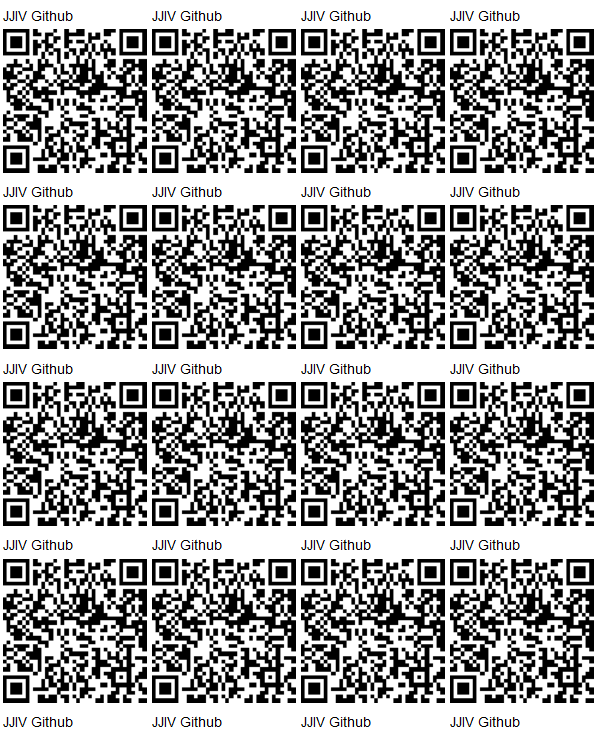
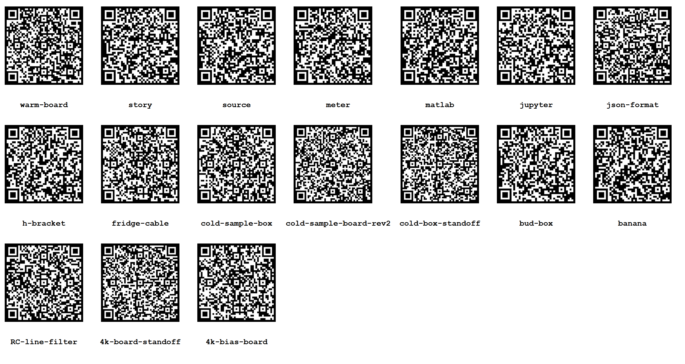

 - [readme reader](readme/readme-reader.html)
 - [readme editor](readme/readme-editor.html)

# JJIV: Josephson Junction IV Curve Tracer System

[Open source hardware instrument](https://github.com/lafelabs/OSHI) for measuring the current-voltage characteristics(IV curves) of [Josephson Junctions](https://en.wikipedia.org/wiki/Josephson_effect) via a true symmetric twisted pair measurement.  

The story behind this system can be read in the [story Readme here](story/README.md).

## Mechanical elements

 - [Bud Box and Rack Mount](bud-box/)
 - [H Bracket](h-bracket/)
 - [4k Board Standoff](4k-board-standoff/)
 - [Sample Enclosure Standoff](cold-box-standoff/)
 - [Sample Enclosure](cold-sample-box/)

## Electrical Elements

 - One [Yokogawa GS200 DC Voltage / Current Source](source/)
 - Two [Volt Meters](meter/)
 - [Banana Cables](banana/)
 - [Warm Board](warm-board/)
 - [DB25 to Fischer Fridge Cable](fridge-cable/)
 - [4k Bias Board](4k-bias-board/)
 - [Sample Board](cold-sample-board-rev2/)
 
## Software Elements

 - [Matlab IV Curves](matlab/)
 - [Data Format](json/)
 

