## [Back to Main JJIV](../)

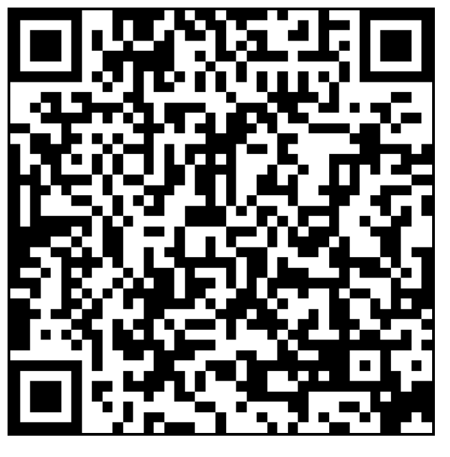
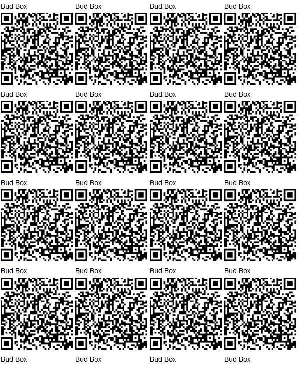

# [Bud Box](https://github.com/lafefspietz/jjiv/tree/main/bud-box)

 - [warm Board](../warm-board/)
 - [CU-347 Bud Box from Hawkusa](https://www.hawkusa.com/manufacturers/bud/enclosures/cu-347)
 - [Rack Mount DIN rail from Amazon](https://www.amazon.com/WatchfulEyE-Mounting-Bracket-Aluminum-Oxidation/dp/B08F4WQX1Z)
 - [Din rail clips](https://www.digikey.com/en/products/detail/phoenix-contact/1201578/290934)
 - [Din rail clip screws](https://www.amazon.com/uxcell-100pcs-Stainless-Tapping-Screws/dp/B01M0P3EUK)
 - [2 4/40 standoffs](https://www.mcmaster.com/91075A462/)
 - [1 Isolated BNC feedthrough](https://www.digikey.com/en/products/detail/amphenol-rf/112431/1011725)
 - [1 25 pin DSUB board mount/panel connector](https://www.digikey.com/en/products/detail/assmann-wsw-components/A-DF-25-PP-Z/1241794)
 - [18 5 volt relay from digikey](https://www.digikey.com/en/products/detail/comus-international/3570-1331-053/7497099)
 - [4 position Selector Switch](https://www.digikey.com/en/products/detail/c-k/A10405RNZQ/3751696) 
 - [6 Banana Jacks](https://www.digikey.com/en/products/detail/cinch-connectivity-solutions-johnson/108-0907-001/5932)
 - [6 Banana plug wires](https://www.digikey.com/en/products/detail/pomona-electronics/B-12-4/737916)
 - [3d printed switch knob](knob.stl)
 - [Color coded solid hookup wire](https://www.digikey.com/en/products/detail/adafruit-industries-llc/1311/6198255)

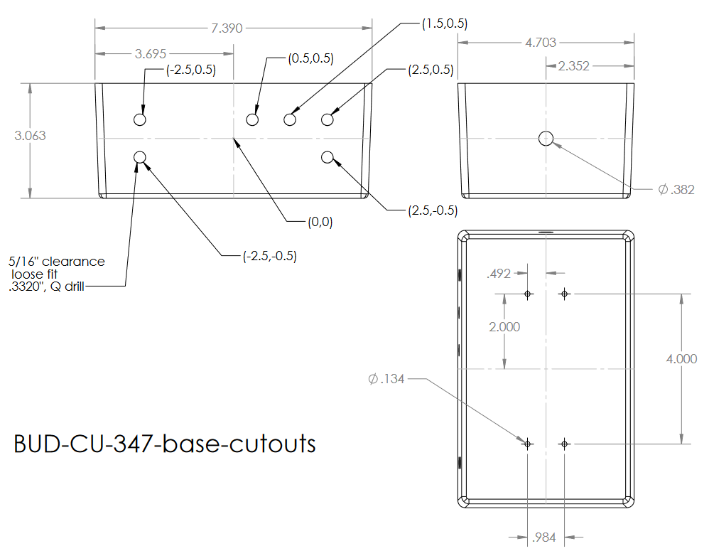

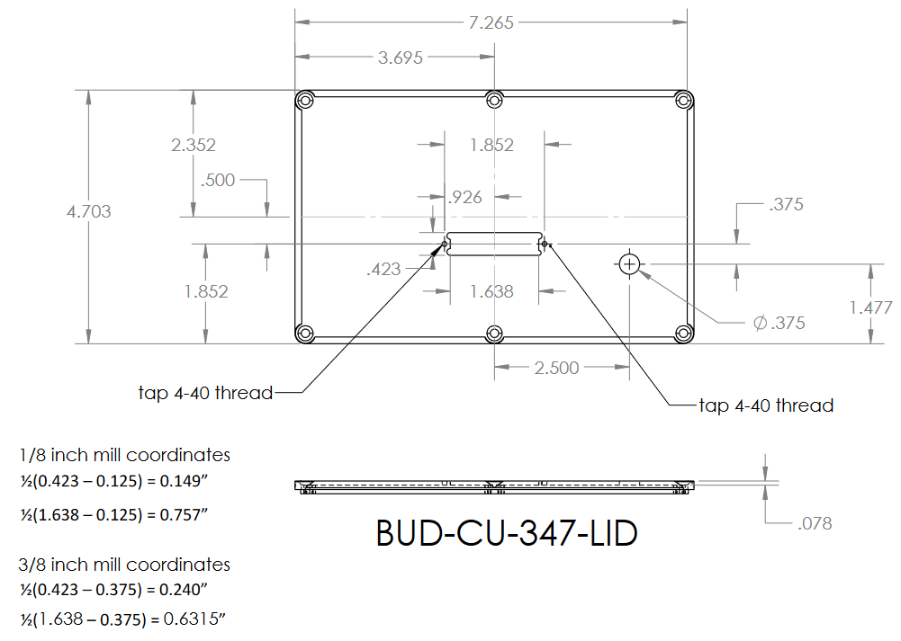

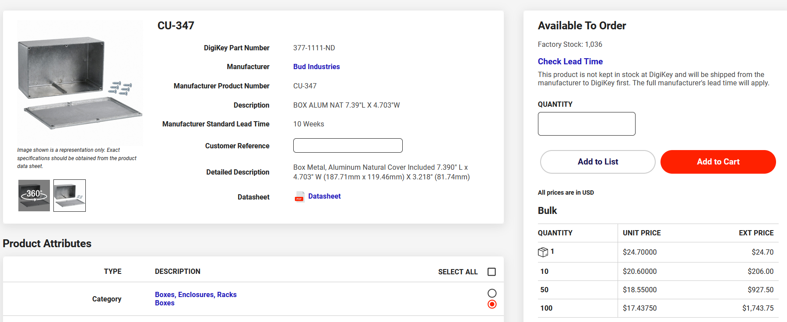

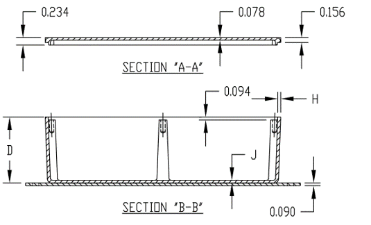

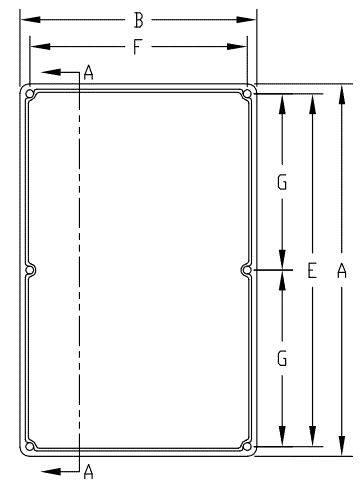

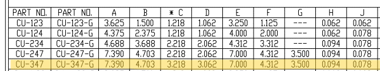

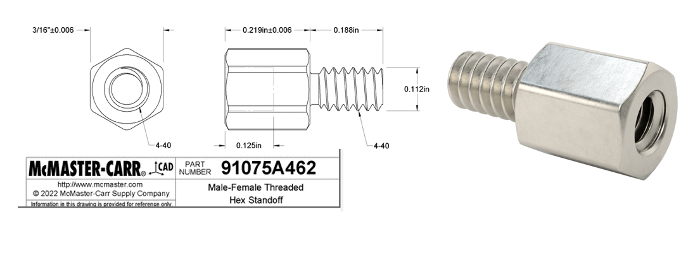

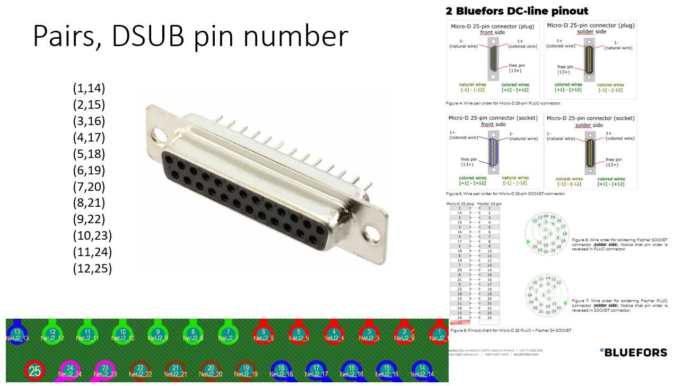

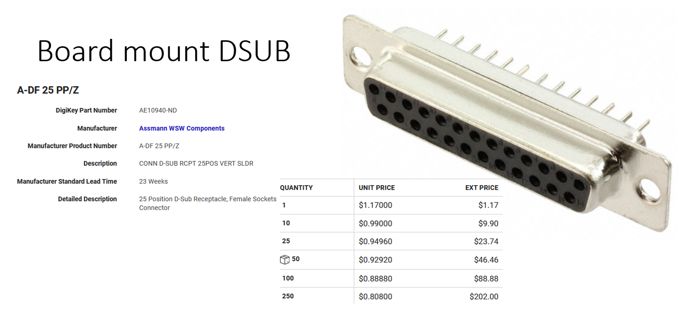

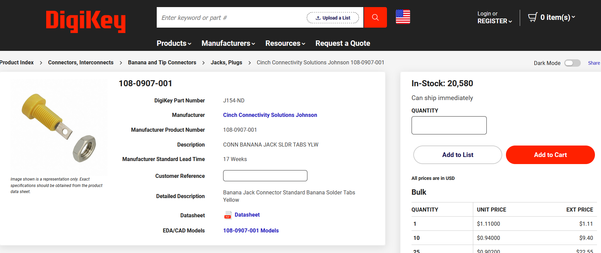

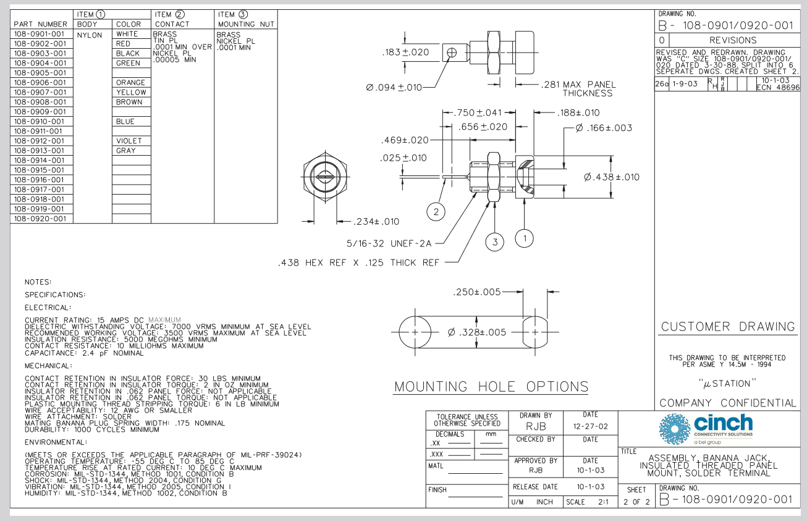

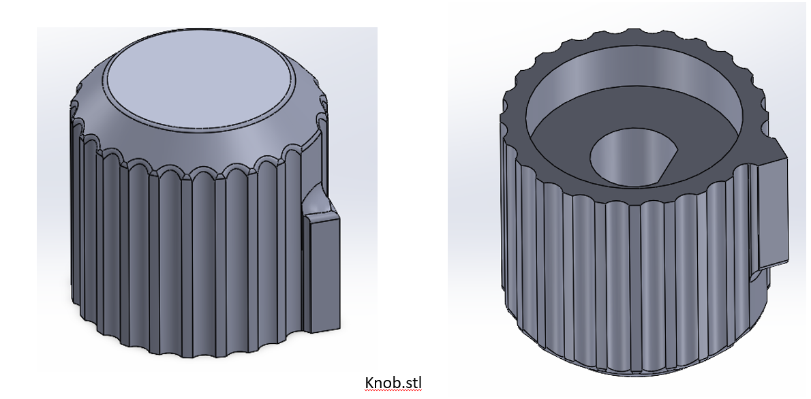

[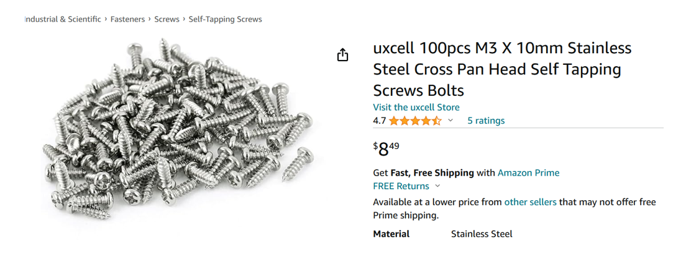](https://www.amazon.com/WatchfulEyE-Mounting-Bracket-Aluminum-Oxidation/dp/B08F4WQX1Z)

[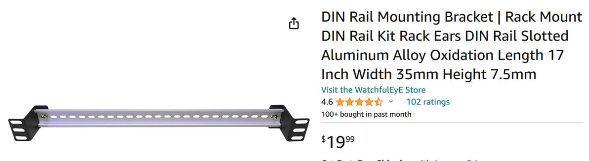](https://www.amazon.com/uxcell-100pcs-Stainless-Tapping-Screws/dp/B01M0P3EUK)

[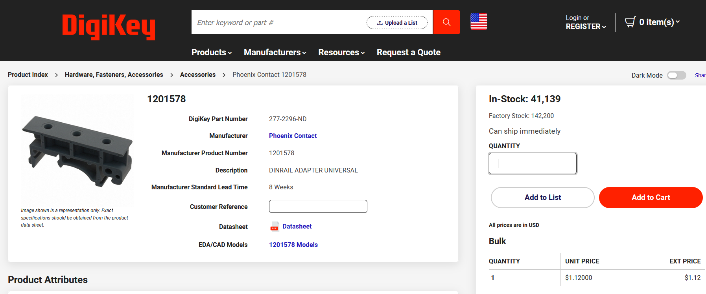](https://www.digikey.com/en/products/detail/phoenix-contact/1201578/290934)

## Files

 - [BUD-CU-347-LID.pdf](AN-1304-A-lid-machined.pdf)
 - [BUD-CU-347-LID.SLDPRT](AN-1304-A-machined-box.SLDPRT)
 - [BUD-CU-347-LID.SLDDRW](BUD-CU-347-LID.SLDDRW)
 - [BUD-CU-347-base-cutouts.pdf](BUD-CU-347-base-cutouts.pdf)
 - [BUD-CU-347-base-cutouts.SLDDRW](BUD-CU-347-base-cutouts.SLDDRW)
 - [BUD-CU-347-base-cutouts.SLDPRT](BUD-CU-347-base-cutouts.SLDPRT)
 - [BUD-CU-347-base-cutouts.STEP](BUD-CU-347-base-cutouts.STEP)

