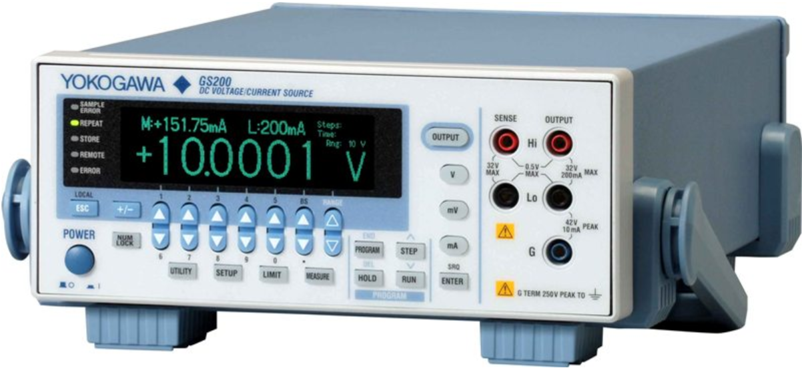

## [Back to JJIV](../)

# Source

One Yokogawa GS200 voltage source drives the twisted pairs.

 - [yokogawa link](https://tmi.yokogawa.com/us/solutions/products/generators-sources/source-measure-units/gs200/)
 - [Used from transcat for $3,995](https://www.transcat.com/yokogawa-gs210-used-for-sale-dc-voltage-current-source)