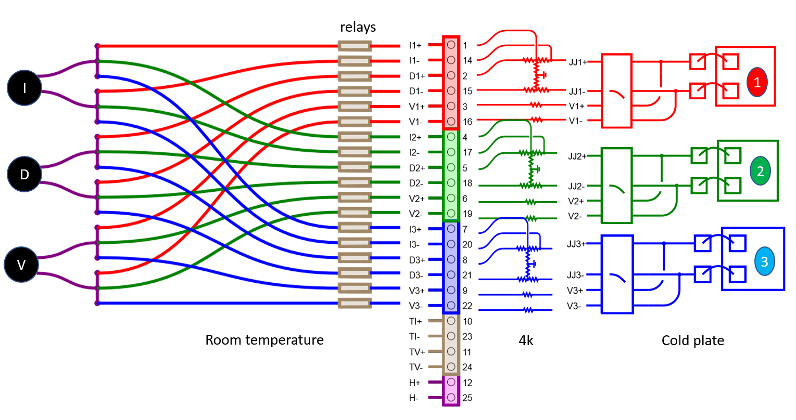

## [Back to JJIV](../)

# JJIV Story

[Josephson Junctions](https://en.wikipedia.org/wiki/Josephson_effect) are electronic devices consisting of two superconducting electrodes separated by an insulating barrier thin enough to allow for [quantum tunneling](https://en.wikipedia.org/wiki/Quantum_tunnelling).  They are analog devices that have been used for [voltage standards](https://en.wikipedia.org/wiki/Josephson_voltage_standard), mixers, detectors, synthesizers, and as the main element to the [superconducting approaches](https://en.wikipedia.org/wiki/Superconducting_quantum_computing) to [quantum computer](https://en.wikipedia.org/wiki/Quantum_computing) development.

This is a system for measuring current-voltage(IV) curves of low critical current(10's of nanoamps) Josephson junctions in a dilution refrigerator.  This work is being carried out in the Superconductive electronics group in the Radio Frequency Division of the Communications Technology Laboratory at the National Institute of Standards and Technology, in Boulder, Colorado.  

The initial system is built for use on a Bluefors dilution refrigerator using the built in twisted pair wiring that ships with those instruments.  

The system consists of a programmable voltage source, a pair of volt meters, a room temperature box which switches the signals between different samples, a connecting that box to the dilution fridge, a bias board with a cold voltage divider and bias resistors, and a cold sample assembly with built in filtering.      

This documentation is intended to allow other researchers to replicate the entire set of components to make a turnkey system for taking IV curves of low critical current Josephson Junctions at dilution refrigerator temperatures.  

