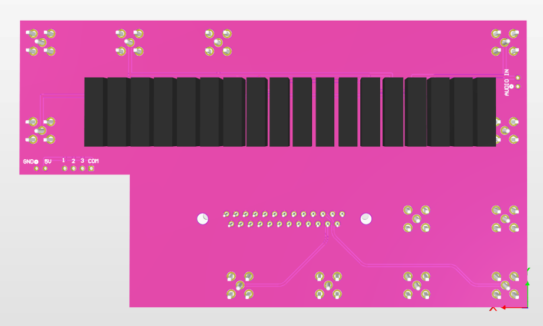

## [Back to JJIV](../)

# Warm Board

Warm Board is the board that goes inside the [Bud Box](../bud-box) which connects the DB25 connector which goes to the dilution refrigerator with the drive, current leads and voltage leads by way of a network of electromechanical relays.  

## Files

 - [warm-pcb-gerbers.zip](warm-pcb-gerbers.zip)
 - [warm-pcb.step](warm-pcb.step)
 - [warm-board.PrjPcb](warm-board.PrjPcb)
 - [warm-board.SchDoc](warm-board.SchDoc)
 
## Bill of Materials(BOM)

 - [1x DB 25 through hole Board connector](https://www.digikey.com/en/products/detail/assmann-wsw-components/A-DF-25-PP-Z/1241794)
 - [2x 4-40 Standoffs](https://www.mcmaster.com/91075A462/)
 - [18x Relay](https://www.digikey.com/en/products/detail/comus-international/3570-1331-053/7497099)
 - [1x 4 Way Switch](https://www.digikey.com/en/products/detail/c-k/A10405RNZQ/3751696)
 - [Color coded solid hookup wire](https://www.digikey.com/en/products/detail/adafruit-industries-llc/1311/6198255)
 - [6x Banana Jacks](https://www.digikey.com/en/products/detail/cinch-connectivity-solutions-johnson/108-0907-001/5932)
 - [Isolated BNC Feedthrough for power]( https://www.digikey.com/en/products/detail/amphenol-rf/112431/1011725)